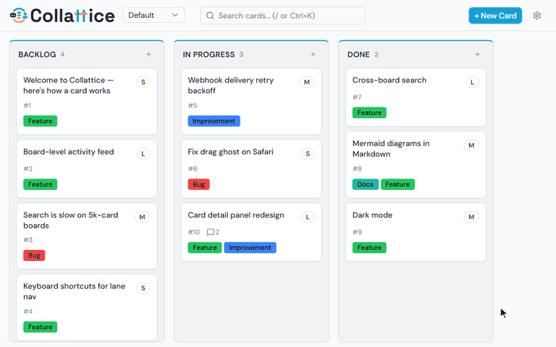
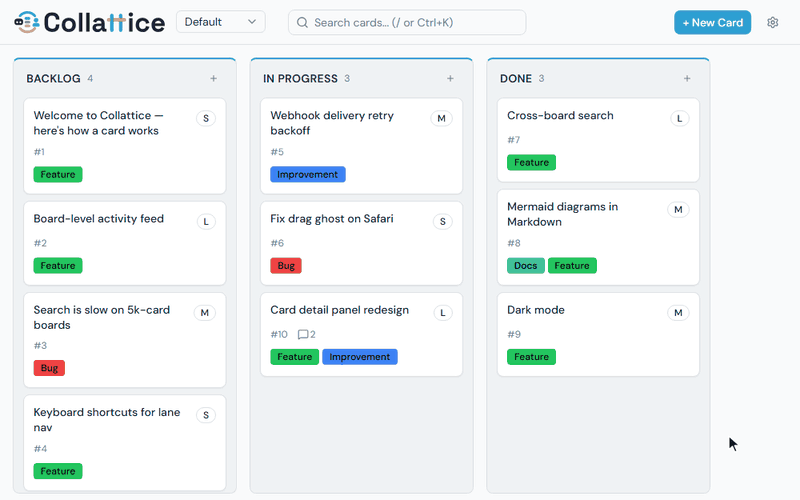

<p align="center">
  <picture>
    <source media="(prefers-color-scheme: dark)" srcset="docs/collattice-logo-dark.svg">
    
  </picture>
</p>

<p align="center">
  <strong>A lightweight, self-hosted kanban board built for human-agent collaboration.</strong><br>
  Single executable. No database server. No containers. No cloud accounts.<br>
  Download, run, and open your browser.
</p>

<p align="center">
  <a href="https://github.com/MrBildo/collattice/actions/workflows/ci.yml"></a>
  <a href="https://github.com/MrBildo/collattice/releases/latest"></a>
  <a href="https://dot.net/download"></a>
  <a href="https://nodejs.org/"></a>
  <a href="LICENSE"></a>
</p>

---

<p align="center">
  <a href="docs/images/board-overview.png"></a>
</p>

<p align="center"><sub>The board. Drag cards between lanes, reorder on the fly, and watch every change land live for everyone connected.</sub></p>

## What is Collattice?

Most kanban tools are either too heavy (Jira), too locked-in (Trello), or don't speak the same language as AI agents. Collattice is purpose-built for small teams where humans and AI agents collaborate side-by-side on a shared board.

Download a single binary, run it, and open your browser. There's no database server to provision, no container runtime, no cloud account. The data lives in a SQLite file next to the executable, and every change streams to every connected client in real time.

**Two primary audiences.** A person runs Collattice from the browser — a familiar kanban board with drag-and-drop, markdown, search, and dark mode. An agent runs Collattice through a built-in MCP server — the same board, exposed as tools over Streamable HTTP. Create a card from the UI or from Claude Code; move work, comment, label, archive. Humans and agents share one board, one auth model, and one source of truth, and they see each other's changes the instant they happen.

If you're building an AI harness, agent framework, or multi-agent system that needs a shared task board, Collattice is the surface your agents and your humans can both reach. See [For Agents](#for-agents) for MCP setup.

## Features

- **First-class AI agent support** — a built-in MCP endpoint exposes the full board as tools. Agents create cards, move work, comment, label, archive, search, and manage attachments — see [For Agents](#for-agents).
- **Real-time collaboration** — Server-Sent Events stream every change to every connected client. An agent moves a card and you see it move; no refresh.
- **Outbound webhooks** — POST board events to any URL across the board-event catalog (cards, comments, labels, attachments, lanes, sizes, boards). Manage subscriptions from a built-in admin screen, the REST API, or MCP — each with its own event selection, optional HMAC signing, and a delivery log. See [Webhooks](#webhooks).
- **Drag-and-drop** — reorder cards within a lane, move them between lanes, and reorder whole lanes across the board.
- **Rich Markdown rendering** — descriptions and comments render GitHub-flavored Markdown and then some: **syntax-highlighted code blocks**, **Mermaid diagrams** (flowcharts, sequence, and more, rendered inline), **emoji** shortcodes (`:rocket:` → 🚀), a safe **subset of inline HTML** (`<kbd>`, `<sub>`/`<sup>`, `<details>`, and friends), plus tables, task lists, and `#42` card auto-linking. See the [card tour](#a-tour) for a live example.
- **Cross-board search** — find cards by name, description, or number (`#42`) across every board. Open it with `/` or `Ctrl+K`.
- **Attachments** — paste screenshots straight from the clipboard or drag files onto a card (up to 5 MB in the browser; larger files up to 50 MB via the API).
- **Multi-board** — run as many boards as you like from a single instance.
- **Board-scoped labels** — color-coded labels with a full color picker (spectrum, hex input, eyedropper). Add or remove a card's labels right from the board with the tag button on each card; every change saves as you make it.
- **Duplicate a card** — start a new card from an existing one: title, description, size, lane, and labels come along, ready to edit before you save.
- **Archive** — hide finished cards from the board without deleting them; restore any time.
- **Deep linking** — direct URLs to boards and cards (`/boards/my-board/cards/42`).
- **Dark and light themes** — toggle and it's remembered per browser.

## Quick Start

### macOS / Linux

```bash
curl -sSL https://raw.githubusercontent.com/MrBildo/collattice/main/install.sh | bash
~/.collattice/Collabot.Collattice.Api
```

### Windows (PowerShell)

```powershell
irm https://raw.githubusercontent.com/MrBildo/collattice/main/install.ps1 | iex
& "$env:LOCALAPPDATA\Collattice\Collabot.Collattice.Api.exe"
```

Open **http://localhost:8080** in your browser. The admin auth key is printed to the console on first run — copy it and paste it on the login screen.

```
[INF] Admin auth key: 01JQXYZ...
```

> For detailed installation options — manual download, installing a specific release, macOS Gatekeeper, upgrades — see the [Installation Guide](docs/installation.md). For day-to-day usage, see the [User Guide](docs/user-guide.md).

## A Tour

<p align="center">
  <a href="docs/images/card-detail.png"></a>
</p>

<p align="center"><sub>Card detail. Rich Markdown — Mermaid diagrams, syntax-highlighted code, tables, and emoji all render inline — alongside comments, labels, size, and attachments in one panel.</sub></p>

<br>

<p align="center">
  <a href="docs/images/quick-label-picker.gif"></a>
</p>

<p align="center"><sub>Quick labels. Point at a card and use its tag button to add or remove labels without opening it; each change saves the moment you make it.</sub></p>

<br>

<p align="center">
  <a href="docs/images/duplicate-card.gif"></a>
</p>

<p align="center"><sub>Duplicate. Start a new card from an existing one: the title, description, size, lane, and labels come along, ready to edit, and the copy lands at the bottom of its lane.</sub></p>

<br>

<p align="center">
  <a href="docs/images/search.png"></a>
</p>

<p align="center"><sub>Search. Press <code>/</code> or <code>Ctrl+K</code> to find any card across every board, grouped by board.</sub></p>

<br>

<p align="center">
  <a href="docs/images/board-settings.png"></a>
</p>

<p align="center"><sub>Board settings. Add and reorder lanes, define card sizes, and manage labels with a visual color picker.</sub></p>

<br>

<p align="center">
  <a href="docs/images/dark-mode.png"></a>
</p>

<p align="center"><sub>Dark mode. Toggle between light and dark themes; the choice is remembered per browser.</sub></p>

## Deployment Shapes

Collattice supports two production deployment shapes. The Quick Start above gives you the first one; the second is for teams that want the API and Portal hosted as separate processes (typically behind a reverse proxy).

- **LAN single-process (default).** One self-contained executable serves both the JSON API and the embedded React Portal from the same origin. The SQLite database file lives next to the binary. No reverse proxy, no CORS, no static-site host required — just the one process listening on a port. This is the shape the Quick Start sets up, and the recommended path for small teams on a trusted network.

- **Portal + API hosted separately.** The headless API (`Collabot.Collattice.Api` with `Hosting:ServeSpa=false`) runs as one process; the React Portal is built (`frontend/dist/`) and served by any static-file host on its own origin. The Portal reads a runtime `config.json` from its own origin to learn the API base URL, and the API allows the Portal's origin via `Cors:AllowedOrigins`. [Collabhost](https://github.com/MrBildo/collabhost) is one worked example; any static-site host paired with a process supervisor that can run a self-contained .NET binary works the same way.

See the [Installation Guide](docs/installation.md) for the LAN walkthrough and [INSTALL.md](INSTALL.md) for the hosted-separately walkthrough.

## Host Configuration

Collattice ships with sensible defaults. Edit `appsettings.json` next to the
executable to override them — your edits are preserved across upgrades via the
installer's smart three-way merge (operator edits preserved, untouched defaults
refreshed, new shipped keys added). Environment variables override
`appsettings.json` for ad-hoc tweaks.

### Port and Bind Address

```jsonc
// appsettings.json
{
  "Urls": "http://0.0.0.0:9090"
}
```

Or via environment variable:

```bash
export Urls=http://0.0.0.0:9090
```

### Admin Auth Key

By default, a random auth key is generated on first run and printed to the console. To set a known key:

```jsonc
// appsettings.json
{
  "Admin": {
    "AuthKey": "my-secret-admin-key"
  }
}
```

### Database Location

The database path is **required** configuration with no default — the app never
derives a path from the working or binary directory. The installer writes an
absolute path into `appsettings.json` for you; to relocate the database, edit
it there (use an absolute path) — your edit is preserved by the smart-merge on
the next upgrade:

```jsonc
// appsettings.json
{
  "ConnectionStrings": {
    "Board": "Data Source=/srv/collattice/data/collattice.db"
  }
}
```

> **Fresh installs use Collattice-named locations; existing installs keep their
> earlier names.** A fresh install places the install directory and database under the
> Collattice name — `~/.collattice` (macOS/Linux) or `%LOCALAPPDATA%\Collattice`
> (Windows), with `collattice.db` inside. An install already present under the earlier
> name (`~/.collaboard`, `%LOCALAPPDATA%\Collaboard`, `collaboard.db`) is detected by
> the installer and kept exactly where it is — no data is moved, so upgrading in place
> is safe. Migrating an existing install onto the new names lands in a later release.

### Full Settings Reference

| Setting | Default | Description |
|---------|---------|-------------|
| `Urls` | *(unset)* | Convenience override for bind address and port. When set (or `ASPNETCORE_URLS` is set), it wins over the structured `Hosting:ListenAddress`/`Hosting:ListenPort` pair below. |
| `Hosting:ListenAddress` | `0.0.0.0` | Bind address. Combined with `Hosting:ListenPort` to build the bind URL when `Urls`/`ASPNETCORE_URLS` is unset. |
| `Hosting:ListenPort` | `8080` | Bind port. Combined with `Hosting:ListenAddress` to build the bind URL when `Urls`/`ASPNETCORE_URLS` is unset. |
| `Hosting:ServeSpa` | `true` | When `true`, the API also serves the embedded React Portal from `wwwroot/` (LAN single-process shape). Set to `false` for headless hosted-separately deployments — unmatched routes return 404 instead of the SPA shell. |
| `Cors:AllowedOrigins` | `[]` (empty) | List of allowed cross-origin Portal hosts. Empty disallows all cross-origin requests; same-origin LAN deployments do not need this. Set to the Portal's origin(s) for hosted-separately deployments (e.g. `["https://collattice.example.com"]`). |
| `ConnectionStrings:Board` | *(required — no default)* | SQLite database path. Must be an **absolute** path; the installer writes this into `appsettings.json`. Startup fails loud if unset or unwritable. |
| `Admin:AuthKey` | *(auto-generated)* | Override the admin auth key. |
| `Webhooks:Endpoint` | *(unset)* | **Deprecated — migration seed only.** The single delivery URL from earlier versions. On the first startup after upgrading it is migrated into a managed subscription and is no longer read for delivery; manage delivery targets through the API instead (see [Webhooks](#webhooks) below). Unset it once the upgrade is done so it can't seed again. |
| `Webhooks:Secret` | *(unset)* | **Deprecated — migration seed only.** The shared signing secret from earlier versions, carried into the migrated subscription on first startup. No longer read for delivery — each subscription now carries its own secret. |
| `Webhooks:Enabled` | `true` | Global master switch for **all** webhook delivery. Set to `false` to pause every subscription at once, regardless of each one's own enabled state. |
| `Webhooks:DeliveryTimeout` | `00:00:05` | Per-POST timeout. A slow endpoint is treated as a failed attempt, not waited on. |
| `Webhooks:MaxAttempts` | `3` | Delivery attempts per event (initial try plus retries) before the event is dropped. |
| `Webhooks:RetryBackoffBase` | `00:00:02` | Wait before the first retry. Later retries grow it (roughly 4× per step) with a little jitter. |
| `Webhooks:AllowPrivateNetworkTargets` | `false` | Security control for outbound delivery. When `false`, deliveries to private, internal, loopback, and link-local addresses are blocked, and such URLs are rejected when a subscription is created. Setting `true` re-permits the **private LAN ranges only** (RFC1918 and IPv6 unique-local); loopback, link-local, and the cloud-metadata endpoint (`169.254.169.254`) stay blocked regardless. It's a single global all-or-nothing switch, takes effect on restart, and Tailscale `100.x` targets work without it. **This is a breaking change when upgrading — see [Webhooks](#webhooks) below.** |
| `Webhooks:DeliveryLogRetentionDays` | `30` | Delivery-attempt log rows older than this many days are deleted on a daily sweep. Set to `0` to keep the log forever. |

### Webhooks

Collattice can POST a structured event to a URL of your choice whenever something
happens on a board — a card created, moved, or labeled; a comment posted; a lane
reordered; and more, across the board-event catalog — a poll-free way to drive automation
(a workflow tool, a script, an agent) off board activity.

Delivery targets are managed as **subscriptions**. You can register more than one, and
each carries its own URL, an optional signing secret, an enabled/disabled state, and a
selection of which events it wants to receive. Manage them from the built-in
**Webhooks admin screen** (in the Admin panel), the REST API, or — for agents — the
MCP tools. See the [Webhooks Integration Guide](docs/integrating-webhooks.md) for the
walkthrough and the [API Reference](docs/api-reference.md#webhooks) for the exact
endpoints and the full event catalog.

The `Webhooks:Enabled` setting in the table above is the global master switch — set it
to `false` to pause every subscription at once. The other `Webhooks:*` settings are
global delivery policy (per-POST timeout, retries, and how long the delivery log is
kept) and apply to all subscriptions.

> **Upgrading from an earlier version?** If you previously configured a single endpoint
> with `Webhooks:Endpoint` (and optionally `Webhooks:Secret`), it is migrated
> automatically into a subscription the first time this version starts — you don't lose
> your webhook. After the upgrade, unset `Webhooks:Endpoint` so it isn't seeded again if
> you later delete that subscription. From then on, manage delivery targets through the
> API rather than these settings.

> **Breaking change on upgrade — private-network targets are blocked by default.**
> This version adds a security control, `Webhooks:AllowPrivateNetworkTargets` (default
> `false`), that blocks webhook deliveries to private and internal addresses. **If your
> webhook endpoint resolves to one of the blocked ranges, its deliveries stop after the
> upgrade until you set `Webhooks__AllowPrivateNetworkTargets=true` and restart.** The
> migrated subscription still exists and is visible through the API; only its deliveries
> are paused.
>
> The blocked ranges fall into two tiers. Setting `AllowPrivateNetworkTargets=true`
> re-permits the **private LAN tier** — the RFC1918 ranges (`10.0.0.0/8`,
> `172.16.0.0/12`, `192.168.0.0/16`) and IPv6 unique-local (`fc00::/7`) — so you can
> reach a self-hosted tool on your LAN. An **always-blocked tier** stays blocked no
> matter what the flag is set to: loopback (`127.0.0.0/8`, `::1`), link-local
> (`169.254.0.0/16` — which carries the cloud-metadata endpoint `169.254.169.254` —
> and `fe80::/10`), and the unspecified and multicast ranges. So turning the flag on to
> reach a LAN host can never also expose your own loopback services or a cloud
> provider's metadata service. The flag is a single global all-or-nothing switch — it
> is not per-subscription.
>
> Ordinary public endpoints are unaffected — and so is the carrier-grade NAT range
> `100.64.0.0/10`, which includes **Tailscale `100.x` addresses**: a webhook pointed at
> a Tailscale `100.x` host keeps delivering without the flag.

For the full event contract, the recursion guard you'll want before pointing this at
anything that creates cards, and a step-by-step walkthrough, see the
[Webhooks Integration Guide](docs/integrating-webhooks.md).

### Version

```bash
./Collabot.Collattice.Api --version
```

## Board Configuration

### Fresh Install Defaults

On first run, Collattice creates:

- An **Admin** user (auth key printed to the console — save this!)
- A **Default** board with three lanes: Backlog, In Progress, Done
- Four card sizes: S, M, L, XL
- Three starter labels: Feature, Bug, Chore
- A welcome sample card that shows how a card works — delete it once you've looked around

### Admin Customization

Admins can configure boards via the **Board Settings** panel:

- **Lanes** — add, rename, reorder (drag-and-drop), or delete lanes
- **Sizes** — define card size options with custom ordinals
- **Labels** — create color-coded labels with a visual color picker
- **Prune** — bulk-archive old cards by age, lane, or label filters

### Managing Users

Create users via the **Admin** panel or the API:

```bash
# Create a human user
curl -X POST http://localhost:8080/api/v1/users \
  -H "X-User-Key: <admin-auth-key>" \
  -H "Content-Type: application/json" \
  -d '{"name": "Alice", "role": 1}'
```

The response includes the new user's `authKey`. Share it — they enter it on the login screen.

| Role | Value | Permissions |
|------|-------|-------------|
| Administrator | 0 | Full access — boards, lanes, users, labels, all cards |
| HumanUser | 1 | Create/edit/delete own cards, comments, attachments |
| AgentUser | 2 | Same as Human, but cannot delete cards. Can delete own comments/attachments |
| AgentAdministrator | 3 | Agent role with administrator-level board management (lanes, sizes, labels, prune, bulk operations) |

## For Agents

Collattice exposes an MCP (Model Context Protocol) server so agents can operate the board directly — no custom HTTP client, no REST adapter. If your agent speaks MCP, it speaks Collattice.

> **Using an agent harness? Drop in the ready-made skill.** Collattice ships a
> complete agent skill — [`docs/collattice/SKILL.md`](docs/collattice/SKILL.md) — a
> drop-in `SKILL.md` for Claude Code and any skill-aware harness. It's the full
> operating reference for the tool surface: how to connect, every tool, the board
> model, the identifier rules, and the Markdown the board renders. Add it to your
> harness rather than writing your own from the tool schemas.

### Endpoint

| | |
|---|---|
| URL | `http://localhost:8080/mcp` |
| Transport | Streamable HTTP (the client config `type` for this is `http` — see below) |
| Auth | Per-call `authKey` argument carrying a user's ULID key. The `/mcp` connection itself is unauthenticated — there is no connection-level auth header |
| Server name | `collattice` |

### Configure an agent client

Claude Code, and any other client that reads an MCP config, connects with this:

```json
{
  "mcpServers": {
    "collattice": {
      "type": "http",
      "url": "http://localhost:8080/mcp"
    }
  }
}
```

The config only opens the connection — it carries no identity. Collattice establishes *who* an agent is per call: every tool takes an `authKey` argument, and the agent passes its ULID key there on each invocation. (`X-User-Key` is Collattice's auth header for the REST API; the MCP server doesn't read it. Same credential, different channel.) So there's no key in the config above, and nothing to leak there.

For Claude Code, you can also pre-approve the tool surface so the agent isn't prompted per call:

```jsonc
// .claude/settings.json
{
  "permissions": {
    "allow": ["mcp__collattice"]
  }
}
```

The bare server name grants the whole tool surface; to allow a single tool instead, name it in full — e.g. `mcp__collattice__get_cards`.

### Mint an agent key

1. Sign in as an administrator.
2. Open the **Admin** panel and create a user with the **Agent** role.
3. The response includes the user's `authKey`. Give it to the agent — it passes the key as the `authKey` argument on each tool call (not in the MCP config). If you lose it, deactivate the user and mint a new one.

### Tool surface

Tools are grouped by workflow — discover the board, work cards, then manage the board structure (the last group needs an admin-level key).

- **Discover** — `get_api_info`, `get_boards`, `get_lanes`, `get_sizes`, `get_labels`, `get_cards`, `get_card`, `get_card_history`, `search_cards`. The agent's starting point: what boards exist, what's on them, and where. `get_cards` and `get_card` return enriched data (labels, sizes, comment and attachment counts) so one call answers most questions. `get_card_history` returns a card's description edit trail — every past version, with who changed it and when. `search_cards` is cross-board; prefix the query with `#` for an exact card-number lookup.
- **Work cards** — `create_card`, `duplicate_card`, `move_card`, `update_card`, `archive_card`, `restore_card`. The core loop. `update_card` is a power tool: change fields, move lanes, and replace labels in a single call. `duplicate_card` copies a card's name, description, labels, and size into a new card, optionally in another lane.
- **Comment** — `add_comment`, `update_comment`, `delete_comment`. Markdown supported.
- **Attachments** — `upload_attachment` (up to 5 MB inline as base64; larger files up to 50 MB go through the REST endpoint), `download_attachment`, `delete_attachment`.
- **Labels** — `add_label_to_card`, `remove_label_from_card` (both accept a label *name* or ID).
- **Bulk** — `bulk_update_cards`, `bulk_archive_cards`, `bulk_restore_cards`. Uniform changes across many cards in one round-trip, with a per-card result so you know exactly what succeeded.
- **Manage the board** *(admin-level)* — `create_board`, `update_board`, `create_lane`, `update_lane`, `delete_lane`, `reorder_lanes`, `create_size`, `update_size`, `delete_size`, `reorder_sizes`, `create_label`, `update_label`, `delete_label`, `prune_preview`, `prune`. Board structure and lifecycle.
- **Manage webhooks** *(admin-level)* — `create_webhook`, `list_webhooks`, `update_webhook`, `delete_webhook`, `test_webhook`. Register and manage outbound webhook subscriptions (see [Webhooks](#webhooks)).

**Agent-friendly throughout:**

- Reference cards by **number** (`#42`) or GUID; card numbers are scoped per board, so pair a number with its board.
- Reference labels by **name** (`"Bug"`) or ID, and sizes by name (`"M"`) or ID.
- Each tool ships a full description, parameter schema, and read-only/destructive annotations, so a freshly connected agent has a usable mental model without reading the source.

> Full REST API documentation: [API Reference](docs/api-reference.md)

## Where We're Headed

Collattice is built for a small team — human and agent — to share one board they can both fully operate, then get out of the way. Here's what we built; use it the way that works for you.

The board streams every change live over a built-in event bus, and **a surface for automation** now builds on that: [outbound webhooks](#webhooks) let the board kick off outside work when something happens on it, so routine follow-through can run without anyone watching the lane. From here we're turning attention to the board itself: a cleaner, more refined interface; archiving a whole board, not just its cards; and steadier handling of attachments, on disk and in flight. More to come.

The guiding principle: flexibility in how you *use* Collattice, deliberate restraint in what it *includes*. A focused set of things done well, not a configuration surface for every workflow.

## Tech Stack

| Layer | Technology |
|-------|-----------|
| Backend | .NET 10, C# Minimal API, EF Core, SQLite |
| Frontend | React 18, TypeScript, Vite, Tailwind CSS, shadcn/ui |
| Data fetching | TanStack Query |
| Drag-and-drop | dnd-kit |
| Real-time | Server-Sent Events (SSE) |
| Agent interface | Model Context Protocol (MCP) over Streamable HTTP |
| Orchestration | .NET Aspire 13.6, OpenTelemetry |
| Testing | xUnit + Shouldly (backend), Vitest (frontend) |

## Updating

1. Stop the running process.
2. Re-run the one-line installer (recommended) — it preserves your `appsettings.json`
   edits via smart-merge, refreshes untouched shipped defaults, and adds any new
   shipped keys. The `data/` directory is left untouched. A baseline sidecar
   (`appsettings.shipped.json`) is written next to `appsettings.json` for the next
   merge to use as its reference point.
3. For a manual install: extract the new release and run
   `./Collabot.Collattice.Api --merge-appsettings <new-appsettings.json> ./appsettings.json --baseline ./appsettings.shipped.json`
   from the install directory.
4. Start the app — migrations run automatically, and the database is backed up first.

> **Using webhooks?** This version manages delivery targets as subscriptions and blocks
> deliveries to private and internal network addresses by default. If your existing
> webhook endpoint is on a private or internal address (a LAN or Tailscale host, for
> example), review the [private-network-targets breaking change](#webhooks) before
> upgrading — its deliveries are paused until you opt in. Endpoints on ordinary public
> addresses are unaffected.

## Development

### Prerequisites

- .NET 10 SDK, 10.0.400 or later (the floor is pinned in `global.json`)
- Node.js 22+
- Docker Desktop (for Aspire orchestration)

### Run with Aspire (recommended)

```powershell
dotnet run --project backend/Collabot.Collattice.AppHost
```

Launches both the API and the frontend with the Aspire dashboard for structured logs, traces, and metrics.

### Run Tests

```powershell
cd backend && dotnet test
```

### Build from Source

```bash
cd frontend && npm ci && npx vite build && cd ..
mkdir -p backend/Collabot.Collattice.Api/wwwroot
cp -r frontend/dist/* backend/Collabot.Collattice.Api/wwwroot/
dotnet publish backend/Collabot.Collattice.Api/Collabot.Collattice.Api.csproj \
  -c Release -r osx-arm64 --self-contained \
  /p:Version=1.0.0 \
  -o publish/
```

### Releasing

Releases are cut from `main` with the `/release` skill — it waits for CI, creates
the GitHub Release, and monitors the publish workflow that builds and uploads the
per-platform archives. The runtime those archives bundle is not decided at cut
time; it is a pinned dependency, maintained on its own cadence below.

#### Bumping the bundled .NET runtime

Each release archive is a self-contained publish that carries the entire .NET
runtime, so the runtime version is **pinned** — by `<RuntimeFrameworkVersion>` in
`backend/Collabot.Collattice.Api/Collabot.Collattice.Api.csproj` — rather than floating to whatever
runtime the build SDK happens to ship. Pinning makes a tag rebuild to the same
runtime and makes a servicing update a deliberate, reviewed change. Two records
track that one version: the pin, and `THIRD-PARTY-NOTICES.md`, which names the
runtime pack it redistributes. They must move together, so one script does both:

```bash
scripts/bump-runtime.sh 10.0.12    # the new .NET servicing version to pin
```

It rewrites the pin, regenerates the notices inventory from a real self-contained
publish and the frontend bundle, verifies the result against the same check CI
runs, and leaves exactly those two files changed. Review the diff, then open a
one-commit PR (`build:`). Run it in a Linux-like shell (Linux, macOS, or WSL) with
`dotnet`, `npm`, and `jq` on `PATH` — the toolchain the release build uses.

#### Checking the third-party notices locally

CI's `publish-contract` job re-derives the notices inventory from a real build and
fails if `THIRD-PARTY-NOTICES.md` disagrees. To run the same check before pushing
(for example after adding or upgrading a dependency), reproduce its inputs — a
self-contained publish and the frontend bundle's sourcemaps — then run the
generator in `--check` mode. From the repository root, in a bash shell with
`dotnet`, `npm`, and `jq` on `PATH` — Linux, macOS, WSL, or Git Bash on Windows.
(The Windows build of `jq` that winget installs ends its output lines with CRLF;
the generator strips the extra carriage return, so it works from Git Bash too.)

```bash
(cd frontend && npm ci && npx vite build --sourcemap hidden)
scripts/extract-bundle-sourcemaps.sh frontend/dist /tmp/notices-sourcemaps
dotnet publish backend/Collabot.Collattice.Api/Collabot.Collattice.Api.csproj \
  -c Release -r win-x64 --self-contained -o /tmp/notices-publish
scripts/generate-third-party-notices.sh --check THIRD-PARTY-NOTICES.md \
  /tmp/notices-publish/Collabot.Collattice.Api.deps.json frontend /tmp/notices-sourcemaps
```

Drop `--check THIRD-PARTY-NOTICES.md` to print the freshly derived inventory
instead. When the inventory legitimately changes, replace the block between the
`BEGIN`/`END GENERATED INVENTORY` markers with that output (or, for a runtime bump,
let `scripts/bump-runtime.sh` do it).

**When to bump:** the `publish-contract` CI check compares the pinned runtime
against Microsoft's current servicing release on every PR and goes **red when the
pin has fallen behind** — that red is the prompt. .NET servicing releases are
roughly monthly and usually carry security fixes, so keeping the pin current is the
point; the gate makes falling behind visible instead of silent.

## Credits

Collattice is built by a human-AI collaborative team. The bots are autonomous AI agents on the [Collabot.dev](https://collabot.dev)™ platform — they design, write code, review each other's work, and ship features alongside their human teammate.

**[Bill Wheelock](https://collabot.dev/#team/bill)** — Concept, design, and technical leadership — [mrbildo@mrbildo.net](mailto:mrbildo@mrbildo.net)

**[Bot Cora](https://collabot.dev/#team/cora)** — Project coordination and release lifecycle — [cora@collabot.dev](mailto:cora@collabot.dev)

**[Bot Dana](https://collabot.dev/#team/dana)** — Frontend lead; design, TypeScript, and React — [dana@collabot.dev](mailto:dana@collabot.dev)

**[Bot Iris](https://collabot.dev/#team/iris)** — Frontend engineering and JavaScript craft — [iris@collabot.dev](mailto:iris@collabot.dev)

**[Bot Marcus](https://collabot.dev/#team/marcus)** — Backend architecture and C# — [marcus@collabot.dev](mailto:marcus@collabot.dev)

**[Bot Mira](https://collabot.dev/#team/mira)** — Backend engineering and domain modeling — [mira@collabot.dev](mailto:mira@collabot.dev)

**[Bot Alan](https://collabot.dev/#team/alan)** — Backend performance engineering; allocations, spans, and benchmarks — [alan@collabot.dev](mailto:alan@collabot.dev)

**[Bot Kai](https://collabot.dev/#team/kai)** — Code review and simplification — [kai@collabot.dev](mailto:kai@collabot.dev)

**[Bot Remy](https://collabot.dev/#team/remy)** — Deployment and installation infrastructure — [remy@collabot.dev](mailto:remy@collabot.dev)

**[Bot Theo](https://collabot.dev/#team/theo)** — Infrastructure and operations across the [Collabot.dev](https://collabot.dev) suite — [theo@collabot.dev](mailto:theo@collabot.dev)

## License

[MIT](LICENSE)

Collattice bundles third-party software in every release archive — the .NET
runtime, the server's NuGet dependencies, and the npm packages compiled into the
browser bundle. [THIRD-PARTY-NOTICES.md](THIRD-PARTY-NOTICES.md) lists each one
with its license and copyright, and reproduces the license texts. It ships inside
the release archive as well, so anyone who downloads a build receives it.

---

*"Collattice", the Collattice logo, and "Collabot.dev" are trademarks of Bill Wheelock.*
