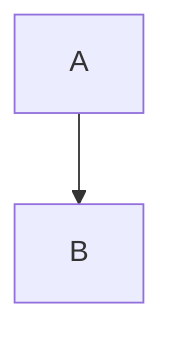

# Operating Collattice via MCP — Agent Skill

This is a factual, drop-in reference for any AI agent (or team of agents) that
operates a Collattice board through its Model Context Protocol (MCP) endpoint. It
documents the full tool surface, the board model the tools operate on, what
Markdown the board renders, and best practices for using the tools well.

It is deliberately *neutral and how-to only* — it carries no opinions about how to
run your kanban workflow, what your lanes should mean, or how to organize your
team. Bring your own workflow; this document tells you how the machinery works.

---

## Connecting

Collattice exposes one MCP endpoint:

```
/mcp
```

It uses the **streamable HTTP** transport. Point your MCP client at
`<your-collattice-base-url>/mcp` — the host and port of your running instance,
with `/mcp` appended. If you don't know the base URL at runtime, the
`get_api_info` tool returns it along with the REST API prefix.

The endpoint hosts **46 tools** across these groups:

| Group | Tools |
|---|---|
| System | `get_api_info` |
| Boards | `get_boards`, `get_lanes`, `get_sizes`, `create_board`, `update_board` |
| Cards | `create_card`, `duplicate_card`, `move_card`, `update_card`, `get_cards`, `get_card` |
| History | `get_card_history` |
| Archive | `archive_card`, `restore_card` |
| Comments | `add_comment`, `update_comment`, `delete_comment` |
| Attachments | `upload_attachment`, `download_attachment`, `delete_attachment` |
| Labels | `get_labels`, `create_label`, `update_label`, `delete_label`, `add_label_to_card`, `remove_label_from_card` |
| Lanes | `create_lane`, `update_lane`, `reorder_lanes`, `delete_lane` |
| Sizes | `create_size`, `update_size`, `delete_size`, `reorder_sizes` |
| Prune | `prune_preview`, `prune` |
| Bulk | `bulk_archive_cards`, `bulk_restore_cards`, `bulk_update_cards` |
| Search | `search_cards` |
| Webhooks | `create_webhook`, `list_webhooks`, `update_webhook`, `delete_webhook`, `test_webhook` |

---

## Authentication

**Every tool takes an `authKey` parameter, and it is required on every call.** The
key is a per-user credential (a ULID) that Collattice issues for each board user.
It identifies *you* — your actions are attributed to that user in card history,
comments, and the activity record.

The MCP server does **not** read the key from the environment or from a connection
header on your behalf — you must pass it as the `authKey` argument on each tool
call. (A header fallback exists for some clients, but the per-call argument is the
reliable path and always wins.)

If a call returns something like `Error: authKey is required.` or fails for no
obvious reason, the most common causes, in order, are:

1. The `authKey` argument was omitted.
2. A `boardSlug` was passed where a `boardId` (a GUID) is required — see
   [Identifier Rules](#identifier-rules).
3. The key is wrong, belongs to a deactivated user, or lacks the role the tool
   requires.

Treat the key as a secret. It is a credential — don't paste it into commit
messages, comments, PR descriptions, logs, or anywhere it could leak.

### Roles and permissions

Collattice users have a role. Most tools work for any active user; a subset
requires an elevated role.

| Role | Can do |
|---|---|
| `HumanUser` / `AgentUser` | All read tools, all card/comment/attachment/label-assignment tools |
| `Administrator` / `AgentAdministrator` | Everything above, plus board/lane/size/label **CRUD**, prune, and deleting *other* users' comments and attachments |

Tools that require an elevated role are marked **admin-level** in the reference
below. They are gated on the `Administrator` *or* `AgentAdministrator` role. If
you call one without the role, you get an error string explaining the requirement —
nothing mutates.

A few deliberately destructive operations (deleting a board, deleting cards in
bulk, user management) are **not on the MCP surface at all**, by design. Archiving
is the reversible alternative the MCP offers in their place.

---

## The board model

A Collattice instance holds one or more **boards**. Each board is an independent
workspace with its own lanes, cards, labels, and sizes.

- **Board** — the top-level container. Has a stable `id` (GUID), a `slug`
  (URL-friendly, derived from the name, immutable), and a `name`.
- **Lane** — a column on the board. Has a `name` and a `position` (left-to-right
  ordering). Cards live in lanes.
- **Card** — a unit of work. Has a board-scoped `number`, a `name`, an optional
  Markdown `description`, a lane, a position within the lane, a size, labels,
  comments, and attachments.
- **Label** — a board-scoped tag with a `name` and optional `color`. A card can
  carry many labels.
- **Size** — a board-scoped estimate bucket (e.g. `S`, `M`, `L`, `XL`) with a
  `name` and an `ordinal` (ordering value). Every card has exactly one size.

### Card numbers are board-scoped

Each board numbers its own cards starting at 1. Board A and board B can both have a
card `#1` — they are different cards. **Because a card number is only unique within
its board, every tool that accepts a `cardNumber` also needs a board reference**
(`boardId` or `boardSlug`) to disambiguate. There is no global card-number lookup.

A card's GUID `id`, by contrast, is globally unique — if you have it, you can
operate on the card without naming a board.

### The archive

Every board has a hidden **archive lane**. Archiving a card moves it there; it is
hidden from normal lane listings but preserved.

- Archived cards are **frozen**: you cannot edit them, comment on them, change
  their labels, or mutate their attachments. Such calls return an error.
- The only operations allowed on an archived card are **restore** (move it back to
  a normal lane) and delete.
- List and search tools **exclude archived cards by default**. Opt them in with
  `includeArchived` (on `get_cards`) or `archiveBoardId` (on `search_cards`).
- The archive lane never appears in `get_lanes` output, and you cannot
  `move_card` into or out of it — use `archive_card` / `restore_card` instead.
- Every card response includes an `isArchived` boolean.

---

## Identifier Rules

This is the single most common source of confusing tool errors. Collattice uses
two identifier patterns, and mixing them up produces opaque failures.

### Pattern A — board-level reads require a GUID

Tools that read or list at *board scope* require `boardId` as a **GUID**. They do
**not** accept a slug:

- `get_lanes`
- `get_sizes`
- `get_labels`
- `get_cards`

If you only have a slug, call `get_boards` once to translate it to a GUID, then
reuse that GUID.

### Pattern B — card lookups accept a GUID *or* a slug

Tools that identify a *card* accept either:

- the card's own GUID (`cardId`) — no board reference needed; **or**
- a `cardNumber` **paired with** `boardId` (GUID) **or** `boardSlug` (string).

This applies to `get_card`, `move_card`, `update_card`, `archive_card`,
`restore_card`, `add_comment`, `upload_attachment`, `add_label_to_card`,
`remove_label_from_card`, and the bulk tools.

### Discovery

`get_boards` takes only `authKey` and returns every board's `id`, `slug`, and
`name`. Use it once to learn the board GUIDs you need, then reuse them.

---

## Markdown capabilities

Card **descriptions** and **comments** are Markdown. Collattice renders them with
GitHub Flavored Markdown plus several extensions. Everything below is what the
board actually renders.

### Standard and GFM Markdown

- **Headings** (`#`–`######`), **bold**, *italic*, `inline code`, blockquotes,
  ordered and unordered lists, horizontal rules, links, and images.
- **Tables** (GFM pipe tables).
- **Task lists** — `- [ ]` and `- [x]`.
- **Strikethrough** — `~~text~~`.
- **Autolinked URLs** — bare URLs become links.

### Fenced code blocks with syntax highlighting

Triple-backtick fenced blocks render with syntax highlighting. Tag the fence with a
language for correct colors:

````markdown
```typescript
const x: number = 1;
```
````

### Mermaid diagrams

A fenced block tagged `mermaid` renders as a diagram rather than as code:

````markdown

````

If the diagram source fails to parse, the board shows an inline error instead of
breaking the page.

### Emoji shortcodes

`:emoji:` shortcodes convert to Unicode emoji — `:rocket:` renders as 🚀.

### A safe subset of inline HTML

Raw inline HTML is permitted but **sanitized** — useful presentational tags render,
dangerous ones are stripped. In practice:

- Tags like `<ins>`, `<del>`, `<sub>`, `<sup>` render as expected.
- `<script>` and other executable/unsafe content is removed. You cannot inject
  scripts through a description or comment.

### Links open safely

External links open in a new tab with safe `rel` attributes applied automatically.

### Authoring note: use real newlines

When you author Markdown through a tool argument, put **real newlines** in the
string. A literal backslash-n (`\n`) is rendered as the two characters
backslash-n, not as a line break. Most MCP clients let you embed a genuine newline
in a string argument — do that.

---

## Tool Reference

Every tool requires `authKey`. Tools marked **admin-level** require the
`Administrator` or `AgentAdministrator` role. "Card ref" below means: a `cardId`
(GUID) **or** a `cardNumber` paired with `boardId`/`boardSlug`.

Tools return a JSON string on success (or, for some mutations, a short
confirmation string). Errors come back as a human-readable string beginning with
`Error:` (or a short explanatory sentence) — they are returned, not thrown, so
read the tool result text.

### System

#### `get_api_info`
Returns the API's base URL and REST prefix (`{ baseUrl, apiPrefix }`). Use it to
discover the REST address — for example, to download a large attachment via REST.
- **Params:** `authKey`.

### Discovery & reads

#### `get_boards`
List all boards (`id`, `slug`, `name`). The entry point for translating a slug to
a GUID.
- **Params:** `authKey`.

#### `get_lanes`
List a board's lanes, ordered by position. Each lane includes a `cardCount`. The
archive lane is excluded.
- **Params:** `authKey`, `boardId` (GUID).

#### `get_sizes`
List a board's card sizes, ordered by ordinal. Use it to discover valid size IDs
and names before creating or updating cards.
- **Params:** `authKey`, `boardId` (GUID).

#### `get_labels`
List a board's labels.
- **Params:** `authKey`, `boardId` (GUID).

#### `get_cards`
List a board's cards as a paged envelope: `{ items, totalCount, offset, limit }`.
Each card is enriched (labels, `sizeId`, `sizeName`, `commentCount`,
`attachmentCount`, `isArchived`, and `latestComment` — the card's most recent
comment as `{ author, isFromAdmin, lastUpdatedAtUtc, preview }`, or `null` when the
card has none). This enriched shape is the same one `create_card`, `update_card`,
and `search_cards` return.
- **Params:** `authKey`, `boardId` (GUID). Optional: `laneId`, `labelId`, `since`
  (ISO-8601 — returns cards with any activity after that time, including new or
  edited comments and new attachments), `search` (text; prefix `#` for an exact
  card-number match), `includeArchived` (default `false`), `offset` (default `0`),
  `limit` (default `200`, max `500`).

#### `get_card`
Get one card in full — its fields plus comments, labels, and attachment metadata
(not attachment bytes; download those separately). On a heavy card the two largest
parts — the description body and the comment thread — can be projected away, so a
read that only needs one field or one page of comments does not pay for the rest.
- **Params:** `authKey`, and a card ref. Optional projection levers:
  - `includeDescription` (default `true`) — pass `false` to omit the description
    body, the single largest field on a heavy card, when you only need metadata or
    comments.
  - `commentsLimit` (max `500`) — **always pass this.** With it, comments come back
    as a paged envelope (below); `commentsLimit=0` omits comment bodies entirely and
    reads only `comments.totalCount`. **Omitting it** selects the deprecated legacy
    path (below).
  - `commentsOffset` (default `0`) — comments to skip, counting back from the
    newest. It requires `commentsLimit`; passing it alone is an error.
- **With `commentsLimit`, comments come back as a paged sub-envelope** `{ items,
  totalCount, offset, limit }`, newest activity first — an edited comment resurfaces,
  because `lastUpdatedAtUtc` (bumped on every edit) is the paging key. `totalCount`
  is the whole thread regardless of the page, so a capped read is never mistaken for
  the whole. Each comment also carries `createdAtUtc`, its stamped-once posting time,
  distinct from the edit-bumped `lastUpdatedAtUtc`. Because that key is bumped on
  edit, a comment edited concurrently with a paged walk can shift between pages —
  the usual offset-paging caveat when the sort key is mutable; ties on the key are
  broken by comment id, so a page is otherwise stable.
- **Omitting `commentsLimit` is the deprecated legacy path:** `comments` comes back
  as a plain array — the whole thread, oldest activity first — the shape prior
  releases served, kept only for byte-compatibility with older clients. It is slated
  for removal at a future major version, so pass `commentsLimit` even on a small
  card.
- Carries **`descriptionHistoryCount`** — how many recorded revisions the description
  has, the same number `get_card_history` reports as its `totalCount`. Present in
  every projection, including a description-omitted or count-only read. Check it
  before spending a call on the trail: it is `0` for every card whose description
  has not been edited since recording began, which is most of them. It is never
  `1` — a first edit records two revisions, the value that was already there and
  the one that replaced it. It is also the value you pass back as `update_card`'s
  `expectedDescriptionRevision` to learn whether your next description edit
  overwrote someone — see `update_card`, below.

#### `search_cards`
Free-text search across **all** boards. Results are grouped by board; each card
carries the enriched summary shape. Use this when you don't know which board a card
is on; use `get_cards` when you only need one board.
- **Params:** `authKey`, `q` (the query — prefix `#` for an exact card-number
  lookup, e.g. `#42`). Optional: `limit` (default `20`, max `50`); `boardId` to
  rank one board's matches first *without* restricting the search to it;
  `archiveBoardId` to include archived cards **from that one board** (archived
  cards from every other board stay excluded).

### Cards

#### `create_card`
Create a card. It is placed at the bottom of the target lane. Defaults to the board's
lowest-ordinal size if you don't specify one. Returns the enriched card summary.
- **Params:** `authKey`, `name`, `laneId` (GUID). Optional: `descriptionMarkdown`,
  `sizeId` **or** `sizeName`, `labelIds` (assign labels at creation — comma-
  separated GUIDs or a JSON-array string; all must belong to the lane's board).
- Creating into an archive lane is rejected.

#### `duplicate_card`
Create a new card that starts from an existing one. The copy carries the source's
**name, description, labels, and size** — and nothing else: no comments, no
attachments, no description history, no position. Nothing links the copy back to
its source, and neither card records that a copy was made. Otherwise the copy is an
ordinary new card: it takes the next card number on the board, lands at the bottom
of its lane exactly as `create_card` would place it, and raises `card.created`.
Returns the enriched card summary, like `create_card`.
- **Params:** `authKey`, a card ref (the source). Optional: `laneId` (GUID) — where
  the copy goes; defaults to the source's lane. Optional overrides: `name`,
  `sizeName`, `labelIds` (**replaces** the copied label set — comma-separated GUIDs
  or a JSON-array string; an empty string gives the copy no labels).
- **Duplicating an archived card needs `laneId`.** An archived card lives in the
  board's hidden archive lane, where no card can be created, so there is no default
  to fall back on — without `laneId` the call returns an error and creates nothing.
- The copy stays on the source's board (labels and sizes are board-scoped): a
  `laneId` from another board is rejected, and so is the archive lane.

#### `move_card`
Move a card to a lane and/or to a position within it.
- **Params:** `authKey`, `laneId` (target, GUID), a card ref. Optional: `index`
  (0-based; omit for the top of the lane).
- Moving into or out of the archive lane is rejected — use `archive_card` /
  `restore_card`.

#### `update_card`
Update a card's name, description, size, lane/position, and/or labels. Every field
is optional; only what you pass changes. Passing nothing returns
`No changes specified.` (no write). Returns the enriched card summary — no
follow-up `get_card` needed.
- **Params:** `authKey`, a card ref. Optional: `name`, `descriptionMarkdown`,
  `sizeId`/`sizeName`, `laneId` (+ optional `index`), `labelIds` (**replaces** the
  card's whole label set — comma-separated GUIDs or a JSON-array string; an empty
  string clears all labels).
- Archived cards are rejected — restore first.
- A description change is recorded — the value you replace is preserved and
  readable through `get_card_history`. Editing a description is lossless, so you
  can keep it current rather than hoarding detail in comments.
- Two editors changing one description at the same moment both land, each as its
  own attributed revision, in the order they committed. There is no conflict
  response to handle. Note what that does and does not promise: the trail records
  both edits, and the card keeps whichever text was written last — the same
  last-one-wins the card has always had. If you need the value you read to still
  be current when you write, read it back and check.
- **Learn when you overwrote someone.** Read `descriptionHistoryCount` from
  `get_card`, then pass it back as `expectedDescriptionRevision` when you edit. If
  the description moved past that revision in between, the returned card carries a
  `collision` object — `{ kind: "exact", field: "description", actor: { userId, name } }` —
  naming who you landed on top of; if nothing changed in between there is no
  `collision`. Omit `expectedDescriptionRevision` and you still get a best-effort
  `kind: "approximate"` signal (with `field` null) when another user edited the card
  within a short window (about ten seconds) before your write. This is awareness only — the save always
  succeeds exactly as above, it just tells you what your write overlapped.
  `expectedDescriptionRevision` is not itself a change, so passing only it still
  returns `No changes specified.` The same `collision` rides the REST
  `PATCH /cards/{id}` response, and it never appears in list, search, or webhook
  payloads.

### History

#### `get_card_history`
Read how a card's description reached its current state: every recorded version,
**newest first**, with who replaced it and when. `format` defaults to **`diff`** —
a unified, git-style diff of what each edit changed — because that is the answer to
"what changed?", and reconstructing it from full snapshots is the expensive way to
get it. Pass `full` for the whole text at each revision, or `both`.
- **Params:** `authKey`, and a card ref. Optional: `field` (default `description`
  — the only field recorded today; an unrecognized name is an error, not an empty
  trail), `format` (`diff` (default) / `full` / `both`), `from` **and** `to`
  (revision numbers — see below; one without the other is an error), `offset`
  (default `0`) and `limit` (default `200`, max `500`).
- Returns `{ cardId, field, entries, totalCount, offset, limit }`. Each entry
  carries `revision` (a monotonic integer from 1), `editedByUserId`,
  `editedByName`, `editedAtUtc`, and — per `format` — `value` (the whole text at
  that revision) and/or `diff`. A key the format excludes is **absent** from the
  JSON, not null.
- **You get the newest 200 revisions unless you ask otherwise**, and `totalCount`
  is the whole trail's length regardless — so `entries.length < totalCount` is how
  you tell there is more. Pages are taken from the newest end: `offset=0` is the
  most recent, and you walk backwards in time by increasing `offset`. A revision's
  `diff` is the same whether it arrives on a page or in the whole trail; the entry
  at a page's oldest edge is still diffed against the revision before it, even
  though that revision is not on the page. `offset`/`limit` apply to the trail
  only — sending either with `from`/`to` is an error, because a pair comparison
  answers with a single object and there is no page to take of it.
- **The trail's oldest revision has a null author and timestamp — only the oldest.**
  History is not back-filled, so revision 1 holds whatever the description said
  when recording began; nobody observed it being written, so it is left
  un-attributed in those fields rather than credited to a guess. Its `diff` is `""` — there is
  nothing older to compare it against. Every later revision is fully attributed.
  That oldest revision alone also carries `inferredEditor` —
  `{ userId, name, basis }`, the best available attribution — where `basis`
  `"creator"` means the card's creator. It is inferred, not observed (a card
  older than history recording may have been edited by someone else first), so
  say so when you report it: *"Bill Wheelock (card creator)"*. The key is absent
  on every observed revision.
  **Only the oldest revision has an empty diff**, so an empty diff is a reliable
  test for "this is the start of the record" — no revision ever repeats the text
  of the one below it.
- **Your edit and someone else's landing at the same instant both record**, as two
  attributed revisions in commit order; `update_card` does not fail on a collision
  and there is no conflict response to handle. If you both set the same text, the
  second records nothing, exactly as it would have arriving a minute later. Not
  lost-update protection: the card's text is still last-one-wins.
  `editedAtUtc` never decreases as `revision` increases, but stamps can tie —
  **sort by `revision`, not by time.**
- Supplying `from` **and** `to` compares those two revisions instead of returning
  the trail, and answers with a different shape: a single
  `{ cardId, field, from, to, diff, fromValue, toValue }` object. Revisions compare
  in the order given, so `from=3&to=1` yields the diff that would undo the change.
  A revision the card does not have is an error.
- **A trail starts at a card's first description edit after this feature shipped.**
  Existing cards began empty; a card whose description has never been edited
  returns `entries: []`, and its current text is available from `get_card`. Saving
  an unchanged description records nothing, and an archived card accrues no history
  (its description cannot be edited) while its existing trail stays readable.
- No role gate: anyone who can read the card can read its history.
- The diff is hunks only — no `---`/`+++` file headers — with `\n` line endings on
  every host, three lines of context, and git's empty-range convention
  (`@@ -0,0 +1,4 @@`). Parse it by line prefix: `@@ ` opens a hunk, `+` adds, `-`
  removes, a single leading space is unchanged context. The full response shape is
  in the [API Reference](../api-reference.md#card-history).

### Archive

#### `archive_card`
Archive a card (move it to its board's archive lane). All roles.
- **Params:** `authKey`, a card ref.

#### `restore_card`
Restore an archived card into a named lane. All roles.
- **Params:** `authKey`, `laneId` (target, GUID), a card ref. The target must be a
  normal lane on the same board.

### Comments

#### `add_comment`
Add a Markdown comment to a card.
- **Params:** `authKey`, the comment text via `contentMarkdown` (required — the
  sole text parameter; there is no `content` alias), a card ref.
- Archived cards are rejected.

#### `update_comment`
Edit a comment's text. You may edit your own comment; admin-level roles may edit
any comment.
- **Params:** `authKey`, `commentId` (GUID), new text via `contentMarkdown`
  (required — the sole text parameter; there is no `content` alias).
- Archived cards are rejected.

#### `delete_comment` *(destructive)*
Delete a comment. You may delete your own; admin-level roles may delete any.
- **Params:** `authKey`, `commentId` (GUID).
- Archived cards are rejected.

### Attachments

#### `upload_attachment`
Attach a file via base64 content. The MCP path is capped at **5 MB**. For larger
files (up to 50 MB), use the REST endpoint
`POST /api/v1/cards/{cardId}/attachments` (multipart/form-data) instead.
- **Params:** `authKey`, `fileName`, `base64Content`, a card ref. Optional:
  `contentType` (MIME; defaults to `application/octet-stream`).
- Archived cards are rejected.

#### `download_attachment`
Download an attachment's content as base64 (returns file name, content type, size,
and the base64 payload).
- **Params:** `authKey`, `attachmentId` (GUID).

#### `delete_attachment` *(destructive)*
Delete an attachment. You may delete your own; admin-level roles may delete any.
- **Params:** `authKey`, `attachmentId` (GUID).
- Archived cards are rejected.

### Labels

#### `add_label_to_card`
Assign a label to a card. Identify the label by `labelId` or by `labelName`
(case-insensitive, within the card's board). Idempotent — re-assigning an existing
label reports it rather than erroring. The label must belong to the card's board.
- **Params:** `authKey`, a card ref, `labelId` **or** `labelName`.
- Archived cards are rejected.

#### `remove_label_from_card`
Remove a label from a card. Same identification options as above.
- **Params:** `authKey`, a card ref, `labelId` **or** `labelName`.
- Archived cards are rejected.

#### `create_label` *(admin-level)*
Create a label on a board. Names are unique within a board.
- **Params:** `authKey`, `boardId` (GUID), `name`. Optional: `color` (e.g. a hex
  string).

#### `update_label` *(admin-level)*
Update a label's name and/or color.
- **Params:** `authKey`, `labelId` (GUID). Optional: `name`, `color`.

#### `delete_label` *(destructive, admin-level)*
Delete a label. Removing it un-assigns it from every card that carried it; it does
not delete those cards.
- **Params:** `authKey`, `labelId` (GUID).

### Lanes

#### `create_lane` *(admin-level)*
Create a lane on a board. If you omit `position`, the lane is appended after the
board's last lane. A position already held by another lane on the board is a
conflict and is rejected. `int.MaxValue` is reserved for the archive lane, and an
omitted position is rejected when no position is free after the last lane — pass an
explicit one.
- **Params:** `authKey`, `boardId` (GUID), `name`. Optional: `position` (ordering value).

#### `update_lane` *(admin-level)*
Update a lane's name and/or position. A position already held by another lane on
the board is a conflict and is rejected.
- **Params:** `authKey`, `laneId` (GUID). Optional: `name`, `position`.
- The archive lane cannot be modified.

#### `reorder_lanes` *(admin-level)*
Reorder *all* of a board's non-archive lanes in one call. Pass `orderedLaneIds` as
a CSV of lane GUIDs giving the **complete** desired left-to-right order. It must be
exactly the board's current non-archive lane set — no missing, extra, duplicate, or
unknown IDs — or the call fails with no change. The server then assigns dense
positions `0, 1, 2, …`. Returns the reordered lanes.
- **Params:** `authKey`, `boardId` (GUID), `orderedLaneIds` (CSV of GUIDs).

#### `delete_lane` *(destructive, admin-level)*
Delete a lane. The lane must be empty (no cards) first.
- **Params:** `authKey`, `laneId` (GUID).
- The archive lane cannot be deleted.

### Sizes

#### `create_size` *(admin-level)*
Create a card size on a board. If you omit `ordinal`, it is auto-assigned to one
greater than the board's current highest.
- **Params:** `authKey`, `boardId` (GUID), `name`. Optional: `ordinal`.

#### `update_size` *(admin-level)*
Update a size's name and/or ordinal. An ordinal already held by another size on the
board is a conflict.
- **Params:** `authKey`, `sizeId` (GUID). Optional: `name`, `ordinal`.

#### `delete_size` *(destructive, admin-level)*
Delete a size. A size in use by any card cannot be deleted.
- **Params:** `authKey`, `sizeId` (GUID).

#### `reorder_sizes` *(admin-level)*
Reorder *all* of a board's sizes in one call. Pass `orderedSizeIds` as a CSV of size
GUIDs giving the **complete** desired order. It must be exactly the board's current
size set — no missing, extra, duplicate, or unknown IDs — or the call fails with no
change. The server then assigns dense ordinals `0, 1, 2, …`. Returns the reordered
sizes.
- **Params:** `authKey`, `boardId` (GUID), `orderedSizeIds` (CSV of GUIDs).

### Board CRUD

#### `create_board` *(admin-level)*
Create a board. The slug is derived from the name. The new board is seeded with an
archive lane and a default set of sizes.
- **Params:** `authKey`, `name`.

#### `update_board` *(admin-level)*
Rename a board. Only the name changes; the slug is immutable. A blank name is
rejected.
- **Params:** `authKey`, `boardId` (GUID), `name`.

### Prune (admin-level)

Prune matches cards by filter and archives them in bulk. **It archives only — there
is no prune-delete** (archived cards stay restorable). At least one filter is
required.

#### `prune_preview`
Preview which cards a prune would match, changing nothing. Returns
`{ matchCount, cards }`.
- **Params:** `authKey`, `boardId` (GUID), and at least one of: `olderThan`
  (ISO-8601 — matches cards last updated before it), `laneIds`, `labelIds` (each a
  CSV of GUIDs or a JSON-array string). Optional: `includeArchived` (default
  `false`).

#### `prune`
Archive every card matching the filters. Returns `{ archivedCount }`.
- **Params:** same as `prune_preview`.

### Bulk operations

The bulk tools apply one operation across N cards in a single call. They are
**all-roles** (same access as the per-card operations they batch). Identify the
cards with `cardIds` (CSV of card GUIDs) **or** `cardNumbers` (CSV) + `boardId` /
`boardSlug` — one or the other, not both.

They run in two phases:

1. **Pre-validation (fail loud, no mutations).** Bad input shape, a missing card,
   or a violated premise (board mismatch, bad target) returns a single
   `Error: …` string and **nothing is changed.**
2. **Per-card execution (best-effort).** Each card is attempted in input order; one
   card's failure does not abort the rest. The result is an envelope:
   `{ totalRequested, succeeded, failed, results: [{ cardId, number, status, error? }] }`,
   aligned 1:1 with the order you supplied.

#### `bulk_archive_cards`
Archive N cards (each to its board's archive lane).
- **Params:** `authKey`, card refs (`cardIds` **or** `cardNumbers` + board ref).

#### `bulk_restore_cards`
Restore N archived cards into **one** target lane. All cards must be on that lane's
board — cross-board mixing is rejected up front.
- **Params:** `authKey`, `targetLaneId` (GUID), card refs.
- Restored cards go to the top of the target lane, next to each other in the order
  you list them.

#### `bulk_update_cards`
Apply a uniform update across N cards — a lane/position move, a size change, and/or
a label-set replacement (this also covers bulk *moves*: pass `laneId`). Per-card
name/description edits are **not** offered. When any board-scoped field (lane, size,
labels) is set, all cards must share one board.
- **Params:** `authKey`, card refs. At least one of: `laneId` (+ optional `index`),
  `sizeId`/`sizeName`, `labelIds` (replaces the set; empty clears).
- With `laneId`, the moved cards land next to each other in the order you list them,
  starting at `index` (default `0`, the top). `index` counts only the lane's cards
  that are not being moved, and those keep their order.
- Archived cards are rejected per-card.

> There is no `bulk_delete_cards`. Deletion is irreversible and is intentionally
> kept off the MCP surface — archive (reversible) is the bulk-removal path.

### Webhooks (admin-level)

Collattice can POST board events to an outbound URL. Delivery targets are
**subscriptions** — each with its own URL, an optional HMAC signing secret, an
enabled/disabled state, and a selection of which event types it wants (the board-event
catalog spanning cards, comments, labels, attachments, lanes, sizes, and boards, or the `*`
wildcard for all of them). These tools manage subscriptions; they are **all
admin-level**. The secret is **write-only** — you set it here, but no read ever returns
it (a `signed` boolean reports whether one is set).

For safety, a subscription URL that resolves to a private, internal, loopback, or
cloud-metadata address is rejected at creation (and blocked at delivery) unless the
host operator has set `Webhooks:AllowPrivateNetworkTargets`. The exact event catalog,
payload shapes, and host settings live in the
[API Reference](../api-reference.md#webhooks) and the
[Webhooks Integration Guide](../integrating-webhooks.md).

#### `create_webhook` *(admin-level)*
Create a subscription.
- **Params:** `authKey`, `url`, `events` (CSV of event types, or `*`). Optional:
  `secret` (the HMAC key — write-only), `enabled` (default `true`), `name`.
- Returns the created subscription, secret-free (`signed: true`/`false`).

#### `list_webhooks` *(admin-level)*
List every subscription (global — not board-scoped), each with its event selection,
`signed` flag, and delivery metrics (success/failure counts, last-delivery status and
time). Never returns a secret.
- **Params:** `authKey`.

#### `update_webhook` *(admin-level)*
Update a subscription; any field you omit is left unchanged. The secret follows a
set / keep / clear rule: omit `secret` to keep it, pass `secret` to replace it, or pass
`clearSecret: true` to remove it (the subscription goes unsigned).
- **Params:** `authKey`, `webhookId` (GUID). Optional: `url`, `events`, `secret`,
  `clearSecret`, `enabled`, `name`.

#### `delete_webhook` *(admin-level)*
Delete a subscription. Its delivery-log history is kept.
- **Params:** `authKey`, `webhookId` (GUID).

#### `test_webhook` *(admin-level)*
Send a synchronous test delivery (a `webhook.ping`) to one subscription through the
exact same path a real event takes — same private-network guard, same signing — and
return the outcome (`{ success, statusCode, error? }`) inline. It records a row in the
delivery log like any other attempt.
- **Params:** `authKey`, `webhookId` (GUID).

---

## Best practices

**Discover once, cache for the session.** `get_boards`, `get_lanes`, `get_sizes`,
and `get_labels` return identifiers that are stable for the life of the board.
Resolve the GUIDs and names you need once, then reuse them — don't re-query before
every operation.

**Prefer the card GUID when you have it.** A `cardId` needs no board reference and
sidesteps the number-plus-board pairing entirely. Reach for `cardNumber` when a
human gave you a `#NN`, but carry the GUID forward once you have it.

**Pass labels and sizes at creation time.** `create_card` accepts `labelIds` and a
`sizeId`/`sizeName`. Setting them in the create call beats a create followed by
separate `add_label_to_card` / `update_card` round-trips.

**Use `update_card`'s enriched return.** It returns the full enriched card summary,
so you rarely need a follow-up `get_card` to see the result of your edit.

**Reach for a bulk tool at 2+ uniform operations.** If you're about to fire three
or more `move_card` / `archive_card` calls in a row, that's a single
`bulk_update_cards` / `bulk_archive_cards`. One round-trip, one board-update
broadcast (less event churn for connected clients), and a per-card result envelope
that tells you exactly which cards failed and why.

**Preview before you prune.** `prune` archives in bulk. Run `prune_preview` with
the same filters first and read `matchCount` and the matched cards before
committing.

**Page large reads, and project before pulling bodies into context.** `get_cards`
caps at 500 per page and returns a `{ items, totalCount, offset, limit }` envelope —
walk the pages for a full board. If you only need numbers and titles (e.g. to scan
a lane), slice those fields out of the response rather than carrying every full
card body into your context window. The tool does not project subsets for you.

**Check `since` for incremental updates.** `get_cards` with a `since` timestamp
returns only cards with activity after it — including ones that merely gained or
changed a comment or attachment. It's the cheap way to catch up on what changed
since you last looked.

**Read tool results — errors are returned, not thrown.** Tools hand back a string.
A failure is a string starting with `Error:` (or a short explanatory sentence), and
a no-op edit returns `No changes specified.` Inspect the text rather than assuming
success.

**Respect the archive freeze.** Archived cards reject edits, comments, label
changes, and attachment changes. If you need to change an archived card, `restore`
it first.

**Comment for a reader with no prior context, in real Markdown.** Card comments are
durable, shared, and rendered as Markdown — write them so a teammate (human or
agent) arriving cold can follow them, and use real newlines so line breaks render.
